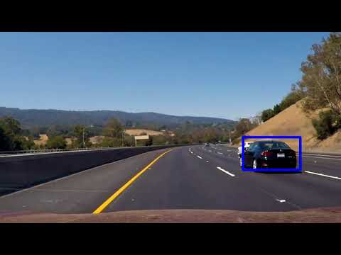
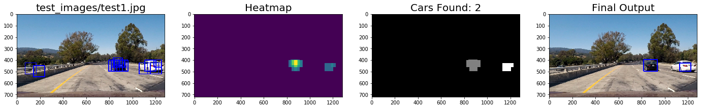
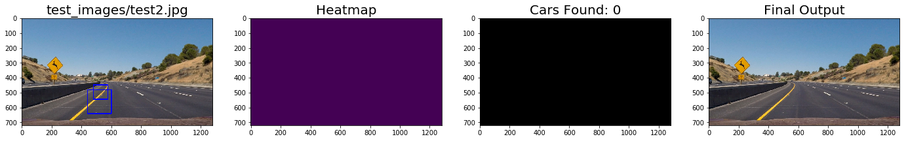
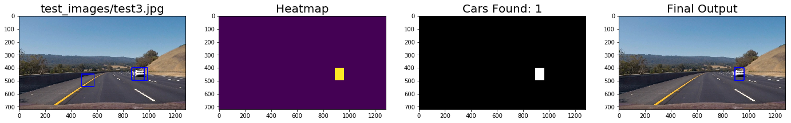
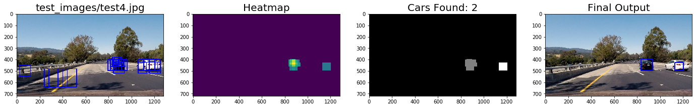
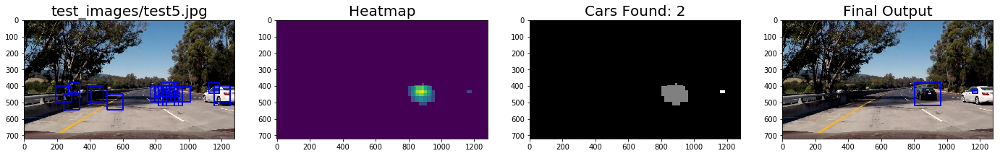
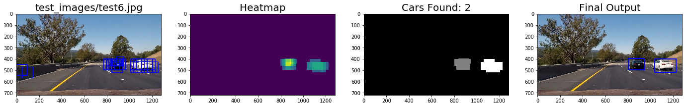

# **Vehicle Detection Project**

The goals / steps of this project are the following:

* Perform a Histogram of Oriented Gradients (HOG) feature extraction on a labeled training set of images and train a classifier Linear SVM classifier
* Optionally, you can also apply a color transform and append binned color features, as well as histograms of color, to your HOG feature vector. 
* Note: for those first two steps don't forget to normalize your features and randomize a selection for training and testing.
* Implement a sliding-window technique and use your trained classifier to search for vehicles in images.
* Run your pipeline on a video stream (start with the test_video.mp4 and later implement on full project_video.mp4) and create a heat map of recurring detections frame by frame to reject outliers and follow detected vehicles.
* Estimate a bounding box for vehicles detected.

[//]: # (Image References)
[image1]: ./output_images/car_not_car.png
[image2]: ./output_images/hog.png
[image3]: ./output_images/sliding_windows.png
[image4]: ./output_images/sliding_windows.png

### Writeup / README

### Histogram of Oriented Gradients (HOG)

#### 1. Explain how (and identify where in your code) you extracted HOG features from the training images.

The code for this step is contained in Cell # 6 of the IPython notebook.

Below is an example of one of each of the `vehicle` and `non-vehicle` classes:

![alt text][image1]

I then explored different color spaces and different `skimage.hog()` parameters (`orientations`, `pixels_per_cell`, and `cells_per_block`).  I grabbed random images from each of the two classes and displayed them to get a feel for what the `skimage.hog()` output looks like.

Here is an example using gray scale and HOG parameters of `orientations=9`, `pixels_per_cell=(8, 8)` and `cells_per_block=(2, 2)`:

![alt text][image2]

#### 2. Explain how you settled on your final choice of HOG parameters.

I went with the color space (`YCrCb`) that optimized the SVM model. 

#### 3. Describe how (and identify where in your code) you trained a classifier using your selected HOG features (and color features if you used them).

See Cell # 8. I trained a linear SVM with default parameters. Final fetures were based on 'spatial, color histogram and HOG features. Following are the parameteres used: 

|Parameter      | Value  |
|---------------|--------|
|Color Space    |YCrCb   |
|Spatial Size   |(32, 32)|
|Histogram Bins |32      |
|Histogram Range|(0, 256)|
|Orient         |9       |
|Pixel per Cell |8		 |
|Cell per Block |2       |
|HOG Channel    |ALL     | 

Final and best test accurcy was 98.59%.

###Sliding Window Search

#### 1. Describe how (and identify where in your code) you implemented a sliding window search.  How did you decide what scales to search and how much to overlap windows?

See Cell # 9. I searched various overlapping window poisitons at different y-scale and window scale. Following are the three sets used and combined. This was more trail and error based to see which provided least false positive and duplicates. 

1. ystart = 380, ystop = 480, scale = 1.0
2. ystart = 400, ystop = 600, scale = 1.5
3. ystart = 480, ystop = 680, scale = 2.5

Below are my test image results.

![alt text][image3]

####2. Show some examples of test images to demonstrate how your pipeline is working.  What did you do to optimize the performance of your classifier?

Ultimately I searched on three scales and three y-range using YCrCb 3-channel HOG features plus spatially binned color and histograms of color in the feature vector, which provided a nice result.  Here are some example images:

![alt text][image4]
---

### Video Implementation

#### 1. Provide a link to your final video output.  Your pipeline should perform reasonably well on the entire project video (somewhat wobbly or unstable bounding boxes are ok as long as you are identifying the vehicles most of the time with minimal false positives.)

See Cell # 15 for Video Pipeline.

#### 2. Describe how (and identify where in your code) you implemented some kind of filter for false positives and some method for combining overlapping bounding boxes.

See Cell # 12-13, I recorded the positions of positive detections in each frame of the video.  From the positive detections I created a heatmap and then thresholded that map to identify vehicle positions.  I then used `scipy.ndimage.measurements.label()` to identify individual blobs in the heatmap.  I then assumed each blob corresponded to a vehicle.  I constructed bounding boxes to cover the area of each blob detected.  

Here's an example result showing the heatmap from a series of frames of video, the result of `scipy.ndimage.measurements.label()` and the bounding boxes then overlaid on the last frame of video. Below are six frames and their corresponding heatmaps, the output of `scipy.ndimage.measurements.label()` on the integrated heatmap from all six frames and the resulting bounding boxes are drawn onto the last frame in the series:

---

### Discussion

#### 1. Briefly discuss any problems / issues you faced in your implementation of this project.  Where will your pipeline likely fail?  What could you do to make it more robust?

Over algorithm does a decent job of detecting vehicles with few false positives. However, performs poorly when cars aren't fully visible or too far away, it doesn't detect in those situtaitons. 

Need to try real time automated methods such as YOLO to reduce false positves, without relying on manual thresholding to detect cars and reduce false poisitives. Also will try deep learning implementation to see model accuracy can be imporved to reduce false positives. 

